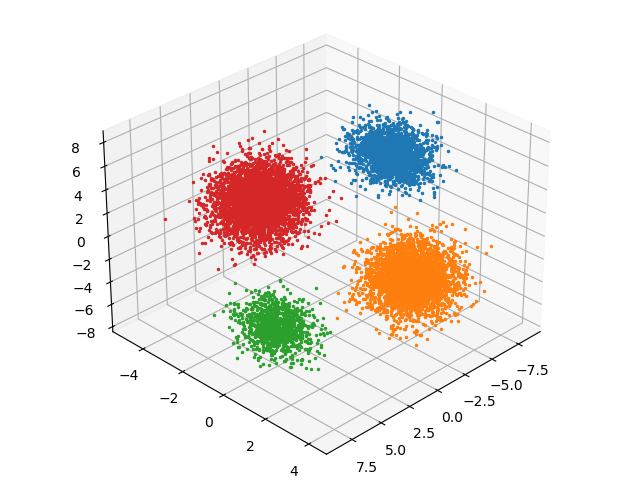

## Instructions

Please use the following command to run algorithms after moving to *ML_est* or *Bayes_est* directory.

#### EM Algorithm(ML estimation)

`python em_gmm.py x.csv z.csv params.dat`

#### VB Algorithm(Bayes estimation)

`python vb_gmm.py x.csv z.csv params.dat`

I describe contents of the outputs *z.csv* and *params.dat* here.

#### z.csv

This file stores the posterior probabilities of latent variables.
Each row corresponds to observed data and each column corresponds to a class.

#### params.dat

This file stores (variational) parameters obtained through each algorithm.
Here, I describe the final value of each parameter, paired with its parameter name.

## Discussions

What is the appropriate number of classes K ?
I ran the EM algorithm with different values of this parameter.

As the above figure shows, the log-likelihood is maximized to　almost the same value when I set the number of classes to equal to or more than 4.
Therefore, K=4 is the optimal value for this dataset.

In fact, it can be reasonable from the figure for clustering using EM algorithm with K=4.

